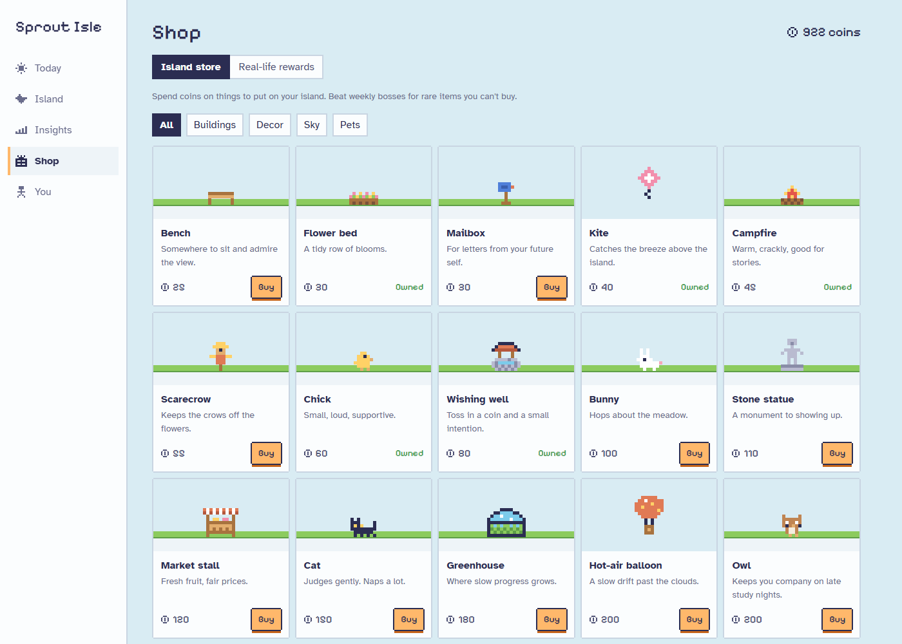
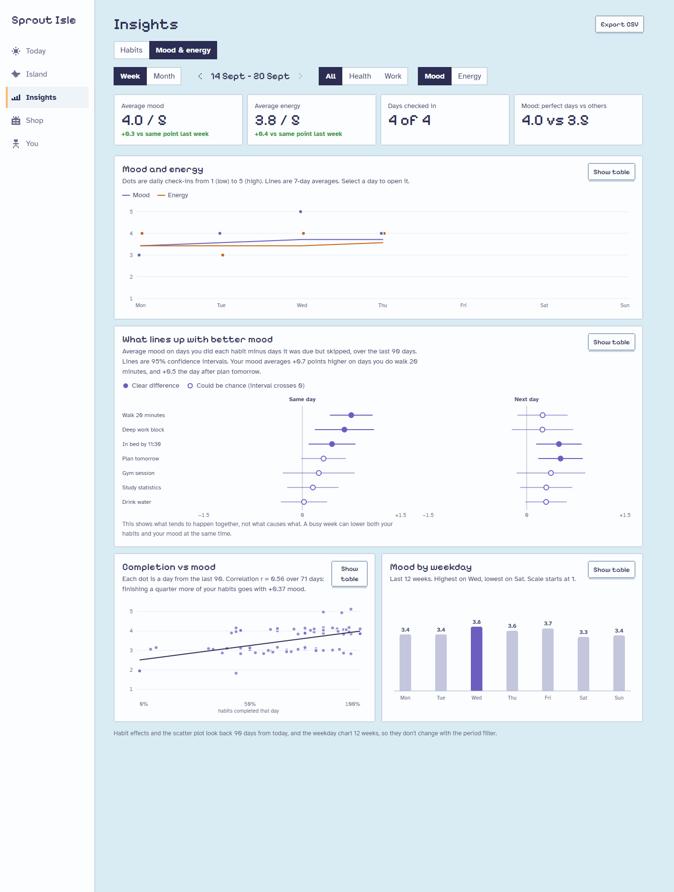

# Sprout Isle

A habit tracker where the habits you keep grow a small pixel island. Health habits grow a grove and work and study habits build a town. Along the way you raise a companion pet, fight a boss each week, and get an Insights tab that looks at your habits next to a daily mood and energy check-in.

Live app: https://sipoflatte.github.io/sprout-isle/

To look around without tracking anything yourself, open the You tab and choose Load sample data. It fills in 90 days of made-up history.


## What it does

### Tracking

A habit can be yes or no, or an amount like 8 glasses of water. It can repeat every day, on chosen weekdays, or a set number of times a week, and you can edit, pause or delete it whenever you like. One-off to-dos earn XP as well.

The week strip and calendar on Today open any past day. You can still tick things off for the last seven days. Older days are read-only so streaks stay honest.

Once a day you can rate your mood and energy from 1 to 5. Both are optional, and checking in counts as showing up for your streak.

### The game side

Finishing habits earns XP and coins. Missing a day doesn't cost you anything. Every seven days in a row earns a streak freeze (you can hold two), and coming back after a gap pays a comeback bonus.

Each Monday brings three quests sized from your last four weeks, plus a boss whose HP is set by how much you usually get done. Habits hit it for 1, 2 or 3 damage depending on effort, so a week with a couple of bad days can still end in a win. The first time you beat each boss it drops an island item you can't buy.

Your companion hatches from an egg as a sprout spirit, a fox or a frog, and grows through three stages as you finish habits. It greets you on Today. After a missed day or a low mood check-in it says something kind instead of cheering you on.

Coins buy buildings, decorations, sky items and pets in the Shop, and you place them on the island from the Island tab. The Shop also holds real-life rewards you set yourself, like an episode of a show.



### Insights

Every chart has tooltips and a table view. Export CSV writes one row per habit per day, with that day's mood and energy, ready for pandas.

The Habits view follows a week or month filter.

| Chart | What it shows |
|---|---|
| Stat tiles | Completion, XP, perfect days and habits completed, compared with the same point last period |
| Daily completion | A column per day with a 7-day rolling mean |
| Habit grid | Every habit on every day, shaded by how close you got to the goal |
| By habit | Completion rate per habit, best first |
| XP earned | XP per day split by area, with bonuses on top |
| Weekly rhythm | Average score for each weekday over 12 weeks |
| Habits that move together | Phi correlation between each pair of habits over 60 days |


The Mood & energy view uses the daily check-ins. You can look at mood, energy, or both together.

| Chart | What it shows |
|---|---|
| Stat tiles | Average mood and energy against the same point last period, days checked in, and mood on perfect days vs other days |
| Mood and energy | Daily ratings with 7-day averages |
| What lines up with better mood | How much higher or lower your rating is on days you did each habit, on the same day and the next, with 95% confidence intervals |
| Completion vs mood | One dot per day, with a least-squares line and Pearson's r |
| Mood by weekday | Average rating for each weekday over 12 weeks |



<p>
  
  
</p>

### Sync

Sync is optional. It keeps devices in step through a secret gist in your own GitHub account, using a token that can only touch gists. Setup steps and the privacy trade-offs are in [docs/SYNC.md](docs/SYNC.md).

## How the data works

The app stores only what you enter: habits, the amount logged each day, to-dos, check-ins, purchases and where you placed things, plus the quests and boss picked at the start of each week. XP, levels, streaks, quest progress, boss damage and all the charts are worked out from those records every time they're needed. If you edit a past day, everything that depends on it updates, and there are no running totals to fall out of step.

| Module | What's in it |
|---|---|
| [`src/lib/engine.ts`](src/lib/engine.ts) | Scheduling, XP, levels, streaks, freezes and bonuses |
| [`src/lib/analytics.ts`](src/lib/analytics.ts) | Period windows, completion scores, rolling means, weekday profiles, correlations and the CSV rows |
| [`src/lib/wellbeing.ts`](src/lib/wellbeing.ts) | Mood and energy trends, habit effects, completion vs rating |
| [`src/lib/stats.ts`](src/lib/stats.ts) | Welch confidence intervals, Student's t values and the least-squares fit |
| [`src/lib/quests.ts`](src/lib/quests.ts) | Picking and scoring weekly quests |
| [`src/lib/bosses.ts`](src/lib/bosses.ts) | Boss HP, damage, wins and loot |
| [`src/lib/pets.ts`](src/lib/pets.ts) | Companion growth and mood |
| [`src/lib/catalog.ts`](src/lib/catalog.ts) | Store items, boss details and the spots on the island |
| [`src/lib/schema.ts`](src/lib/schema.ts) | The zod schema that anything loaded from storage, a backup or a gist has to pass |
| [`src/sync/`](src/sync) | The gist client and the logic that decides whether to upload, download or ask |
| [`src/world/`](src/world) | Pixel sprites and the island scene builder |

## Methods

Completion gives partial credit: a day's score for a habit is `min(amount / target, 1)`, so five glasses out of eight scores 0.625. When a times-per-week habit is viewed over a week or month, its quota is scaled to the days that fall inside the period, which stops a month that starts on a Thursday from counting against you. Comparisons with the previous period use the same number of days into it.

The correlation between two habits is Pearson's r on done or not done, taken over days both were due. For two yes/no series that's the phi coefficient. A pair needs 14 shared days with some variation before it's shown.

For mood and energy, each habit's effect is the average rating on days you did it minus the average on days it was due and you skipped it, over the last 90 days. The interval is a Welch 95% confidence interval, which doesn't assume the two groups have equal variance, and each group needs at least five days. The next-day version pairs each day's habit with the following day's rating. The tests check these intervals against `scipy.stats.ttest_ind(equal_var=False)`. None of this shows cause. A stressful week can drag down both your habits and your mood without one causing the other.

Quest targets come from the last four weeks. Habit quests aim 20 percentage points above your recent completion rate, and area quests 10 points above your recent score. Boss HP is 85% of your average weekly damage over the same four weeks, and new players start at 60% of what their schedule allows.

The sample data has patterns built in on purpose. Walks and deep work lift that day's mood, and getting to bed on time lifts the next day's energy. One of the tests checks that the analysis finds them.

Chart colours were checked for colour-blind separation and contrast in both the light and dark themes.

## Privacy and security

Your data stays in your browser unless you turn on sync. Anything the app reads from storage, a backup file or a gist is checked against a schema with size limits first. CSV exports escape cells that a spreadsheet would otherwise run as formulas. Production builds set a Content Security Policy that only allows network requests to the GitHub API. The sync token is stored apart from your data, so it never ends up in a backup.

## Running it locally

```bash
npm install
npm run dev      # http://localhost:5173 (add ?demo to load sample data)
npm test
npm run build
```

Every push to `main` runs the tests, builds the site and deploys it to GitHub Pages using [`.github/workflows/deploy.yml`](.github/workflows/deploy.yml).

## Built with

React 19 and TypeScript on Vite. The charts are hand-built SVG using d3-scale and d3-shape, validation uses zod, and the tests run on Vitest. Fonts are Pixelify Sans for headings, Tiny5 for numbers and Atkinson Hyperlegible for everything else, all served with the app.

## License

[MIT](LICENSE)
