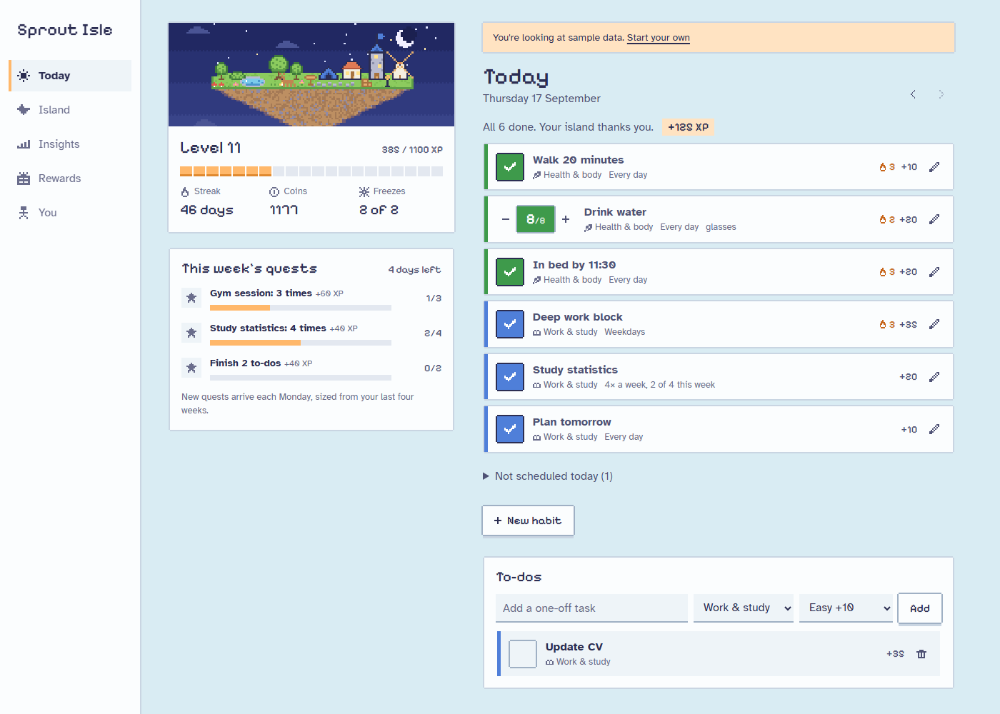
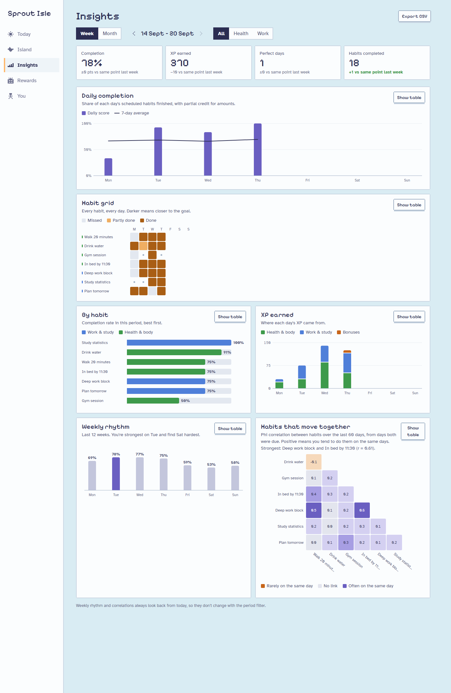
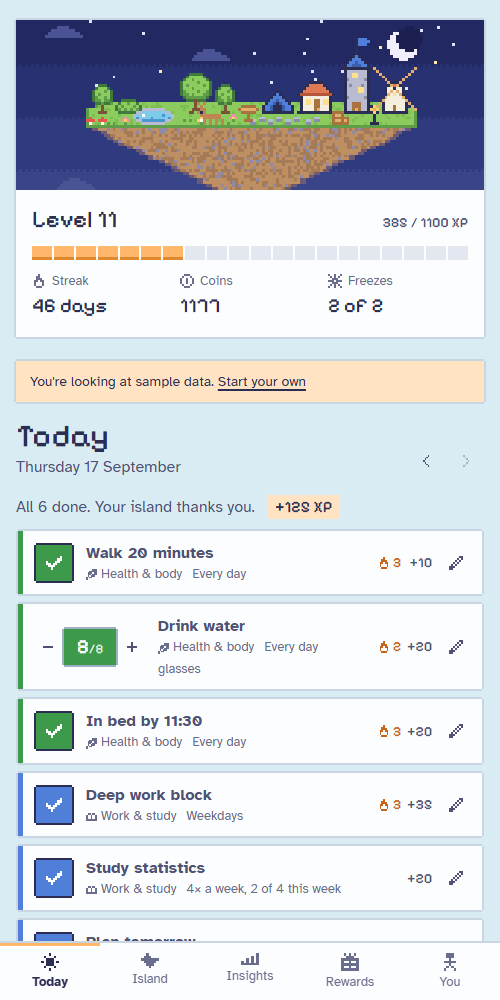
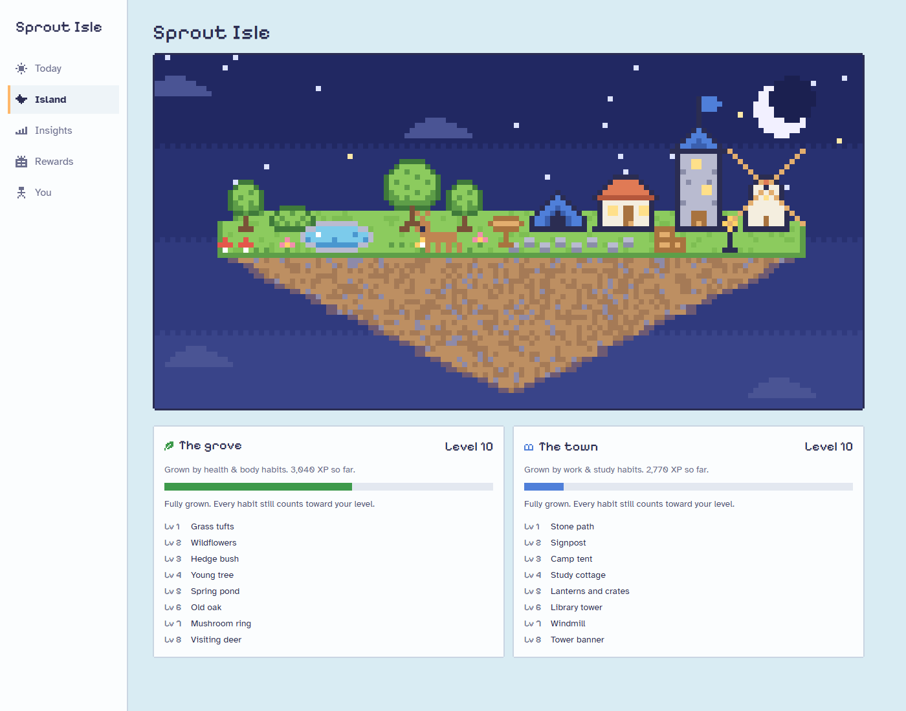

# Sprout Isle

**A habit tracker where every habit you keep grows a small pixel island.**

Health habits grow a grove, and work and study habits build a town. Missing a day
never takes anything away. Streak freezes and comeback bonuses make it easy to get
going again. Behind the game is a proper analytics page built for looking at your
own behaviour data.

**Live app:** https://sipoflatte.github.io/sprout-isle/
(open the **You** tab and choose **Load sample data** to explore with 90 days of history)



## Features

### Tracking
- Yes/no habits or amounts (for example 8 glasses of water), with partial progress.
- Schedules: every day, chosen weekdays, or a number of times per week.
- Add, edit, pause and delete habits at any time. Log up to 7 days back.
- One-off to-dos that also earn XP.

### Game layer
- XP by effort, levels, and a daily streak with freezes (one earned every 7 days, up to 2).
- Perfect-day and comeback bonuses.
- **Weekly quests:** three quests each Monday, sized from your last four weeks.
  The first always targets the habit that has been slipping most.
- A floating island with 16 landmarks unlocked by area level, and a sky that follows the time of day.
- Achievements and a rewards shop where you spend coins on treats you define.

### Insights
Week and month views with a single filter row (period, area) that scopes everything:

| Chart | What it shows |
|---|---|
| Stat tiles | Completion, XP, perfect days and habits completed, compared with the same point last period |
| Daily completion | Column per day with a 7-day rolling mean |
| Habit grid | Habit × day heatmap on a sequential scale |
| By habit | Completion rate per habit, sorted |
| XP earned | Stacked columns by area plus bonuses |
| Weekly rhythm | Mean score per weekday over 12 weeks, best day highlighted |
| Habits that move together | Phi-coefficient matrix between habits over 60 days |

Every chart has hover and keyboard tooltips and a **Show table** view.
**Export CSV** produces a tidy long-format file (one row per habit per day) ready for pandas.



<p>
  
  
</p>

### Sync (optional)
Sync between devices through a secret GitHub Gist in your own account, using a
token that can only access gists. See [docs/SYNC.md](docs/SYNC.md).

## How the data works

Only raw inputs are stored: habit definitions, `logs[date][habitId] = amount`,
to-dos, rewards and the quests generated each week. Everything else (XP, levels,
streaks, quest progress, every chart) is computed from those inputs by pure,
unit-tested functions. Editing a past day therefore updates everything
consistently, with no stored totals to drift out of step.

| Module | Responsibility |
|---|---|
| [`src/lib/engine.ts`](src/lib/engine.ts) | Scheduling, XP, levels, streaks, freezes, bonuses |
| [`src/lib/analytics.ts`](src/lib/analytics.ts) | Period windows, completion scores, rolling mean, weekday profile, correlations, tidy export |
| [`src/lib/quests.ts`](src/lib/quests.ts) | Weekly quest generation and evaluation |
| [`src/lib/schema.ts`](src/lib/schema.ts) | zod schema for anything read from storage, backups or sync |
| [`src/sync/`](src/sync) | Gist client and sync conflict logic |
| [`src/world/`](src/world) | Pixel sprites and island scene builder |

### Method notes
- **Completion score** gives partial credit: `min(amount / target, 1)`.
- **Weekly quotas** are scaled to the part of a week inside the period being viewed,
  so month edges aren't penalised.
- **Period comparisons** use the same number of elapsed days in the previous period.
- **Correlation** is Pearson's r on binary completion over days both habits were due,
  which for two binary series is the phi coefficient. Pairs need at least 14 shared
  days and some variation, otherwise they show as n/a.
- **Quest targets** use the last four weeks: habit quests aim for the recent rate
  plus 20 percentage points, area quests for the recent score plus 10.
- **Chart colours** were checked for colour-vision deficiency separation and contrast
  in both light and dark themes.

## Security and privacy

- Data stays in your browser unless you turn on sync.
- Stored data, imported backups and synced data are validated against a schema with size limits before use.
- CSV exports defuse values that spreadsheets would run as formulas.
- Production builds ship a strict Content Security Policy that only allows connections to the GitHub API.
- The sync token is stored separately from app data, is never included in backups, and is only sent to `api.github.com`.

## Run locally

```bash
npm install
npm run dev      # http://localhost:5173 (add ?demo to load sample data)
npm test
npm run build
```

Pushing to `main` runs the tests, builds, and deploys to GitHub Pages through
[`.github/workflows/deploy.yml`](.github/workflows/deploy.yml).

## Stack

React 19, TypeScript, Vite, d3-scale and d3-shape for chart geometry, zod for
validation, Vitest for tests. Fonts are Pixelify Sans and Atkinson Hyperlegible,
self-hosted.

## License

[MIT](LICENSE)
